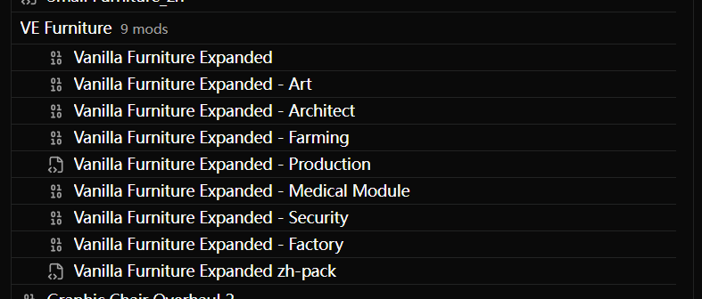
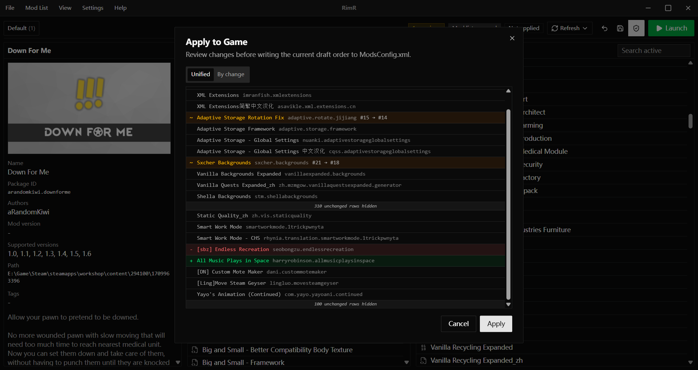
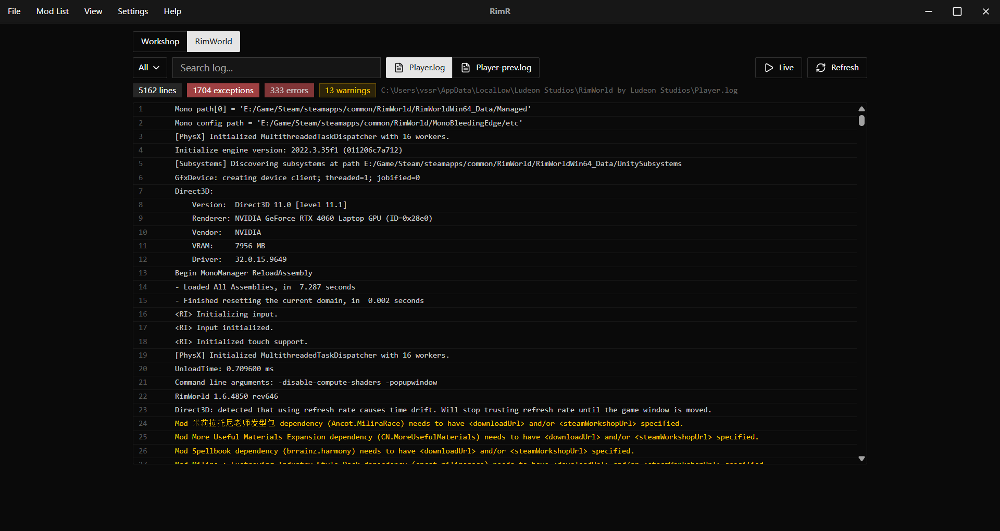

# RimR

[English](README.md) | [中文](README.zh.md)

RimR is a desktop mod list manager for [RimWorld](https://store.steampowered.com/app/294100/RimWorld/). It helps you organize, validate, and apply your mod order before launching the game.

The model is **Library Settings → Mod List → Apply**:

- **Library Settings** store cross-list data such as display aliases and tags.
- **Mod Lists** store RimR-owned mod order metadata, including groups and separators. The order lives in RimR's own data and stays separate from the game's configuration until you decide to apply it.
- **Apply** writes the selected mod list's flattened mod order to RimWorld's `ModsConfig.xml` only when you explicitly choose to apply it.

RimR also supports importing and exporting data files, importing a mod order from a RimWorld save file, switching between English and Simplified Chinese, and managing a local library of mod list snapshots. Save-file order import works with normal `.rws` saves as well as gzip- or zstd-compressed saves created by save compression mods.

## Search

The Active and Inactive lists share the same smart search box. Type normal words to search names, package IDs, aliases, authors, sources, groups, and tags. You can also use filters such as `#tag`, `@"group name"`, `&steam`, `&local`, and `!word` to narrow or exclude results.

Examples:

- `framework #qol` finds mods matching `framework` with a matching `qol` tag.
- `@"Core Mods" &steam` shows Steam Workshop mods in a matching group.
- `graphics !patch` finds graphics-related mods while excluding matches for `patch`.

## Screenshots

<details>
<summary>Click to expand</summary>

### Mod groups and separators



### Apply game diff view



### Logs view



</details>

## Download

Prebuilt installers are available on the [Releases](https://github.com/RhNu/RimR/releases) page.

## Development

Requirements:

- [Node.js](https://nodejs.org/) and [pnpm](https://pnpm.io/)
- [Rust](https://www.rust-lang.org/tools/install)

Run the development app:

```powershell
pnpm install
pnpm tauri dev
```

## Verification

```powershell
pnpm check
cargo test --workspace
```

If desktop build behavior is relevant and the host supports it:

```powershell
pnpm tauri build --no-bundle
```

## Data directory

RimR stores its own data under your platform's application data directory, in a `RimR` folder:

```text
settings.json
mod-lists/index.json
mod-lists/<id>.json
```

## License

RimR is licensed under the [GNU General Public License v3.0](LICENSE).

## Disclaimer

Parts of this project were written or assisted by AI tools.
